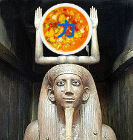

<meta http-equiv="Content-Type" content="text/ html; charset=utf-8"/> 

# Ka - C++ generic components



## Introduction

`Ka` is library of C++ generic components.

Many theories circulate on the origin of this name. Some people assure it comes
from [an ancient egyptian
concept](https://en.wikipedia.org/wiki/Ancient_Egyptian_concept_of_the_soul#Ka_(vital_spark)).
Other claim it refers to the chinese ideogram of power
[力](https://en.wikipedia.org/wiki/Radical_19) (which could be read 'ka' in
japanese). Not to mention those original that maintain that the name is a
contraction of [korma](https://en.wikipedia.org/wiki/Korma). Bref, le mystère
du cas Ka reste entier...

Anyway, each component is designed to have as few dependencies as possible, so
you can easily pick and mix any of them. Here genericity is to be understood in
the STL sense : components that are designed not on *types* but on *concepts*.

A concept is a set of constraints on one or several types. These constraints
can be syntactic (i.e. what the legal expressions are), semantic (i.e. what the
invariants are) or about algorithmic complexity (i.e. what are the space
complexity and time complexity). For a more detailed explanation, see
`concept.hpp`.

The main inspiration for this work is [Elements of
Programming](http://elementsofprogramming.com) (Stepanov-McJones, 2009).


## Content

A classification of the components you will find here:

- functional: simplify the use of functional patterns (function composition,
  function objects...)

- algorithms: `erase_if`, `sha1`...

- ranges: allow to write more general algorithms than those based on iterators
  (bounded, counted, sentinel, transformation... ranges)

- metaprogramming: various type traits

- RAII: `scoped` helpers and affiliated functions

- archetypes: wrappers to check that a type effectively models a concept

- genericity: ensure a type behaves correctly according to copy and equality
  (aka "regularity")


## Example : Use of a 3-way lexicographic compare on ranges

The following illustrates the use of concepts, ranges, function composition,
scoped ressources. Unqualified names denote `Ka` components such as `scoped`,
`bounded_range`, etc.

```cpp
  // ...

  using namespace ka;

  // Ensure by construction that any acquired resource is eventually released.
  // The acquired resource is accessed with `guard.value`.
  auto guard = scoped(my::acquireResource(), [](my::Resource x) {
    my::releaseResource(x);
  });
  
  // ...

  // Create a new function by first transforming something (a container for example)
  // to a range, then skip the first 2 elements.
  // The notation is mathematical function composition, where `(g * f)(x) == g(f(x))`.
  auto skip2 = advance(2) * Range{};

  // Create a (lazy) range from 0 to 100 (excluded).
  auto ints_up_to_100 = bounded_range(0, 100);

  // 3-way lexicographic compare (`container_ints` could be a `std::vector<int>`)
  order_t order;
  std::tie(order, std::ignore, std::ignore) =
    lexicographic_compare_3(skip2(container_ints), ints_up_to_100);

  switch (order) {
  case order_t::greater:
    // ...
  case order_t::equal:
    // ...
  case order_t::less:
    // ...
  }

  // ...
```


## Documentation

See code documentation for information on a specific component.
